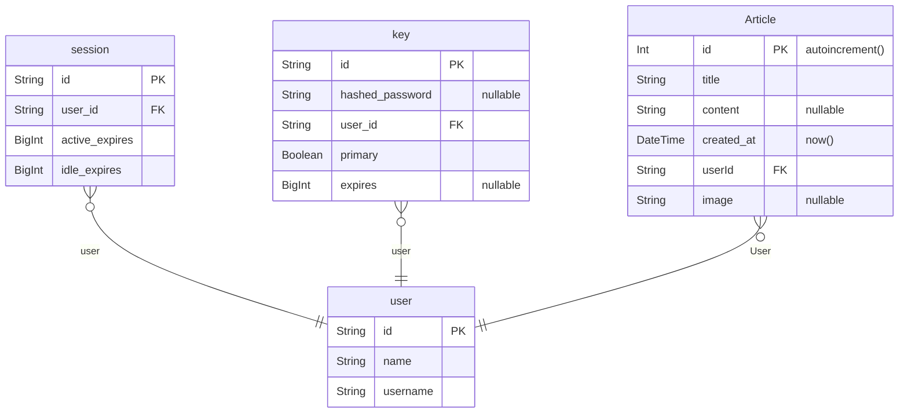

```mermaid
erDiagram
	user {
		String id PK
		String name
		String username
	}
	session {
		String id PK
		String user_id FK
		BigInt active_expires
		BigInt idle_expires
	}
	key {
		String id PK
		String hashed_password  "nullable"
		String user_id FK
		Boolean primary
		BigInt expires  "nullable"
	}
	Article {
		Int id PK  "autoincrement()"
		String title
		String content  "nullable"
		DateTime created_at  "now()"
		String userId FK
		String image  "nullable"
	}
	session }o--|| user : user
	key }o--|| user : user
	Article }o--|| user : User

```
